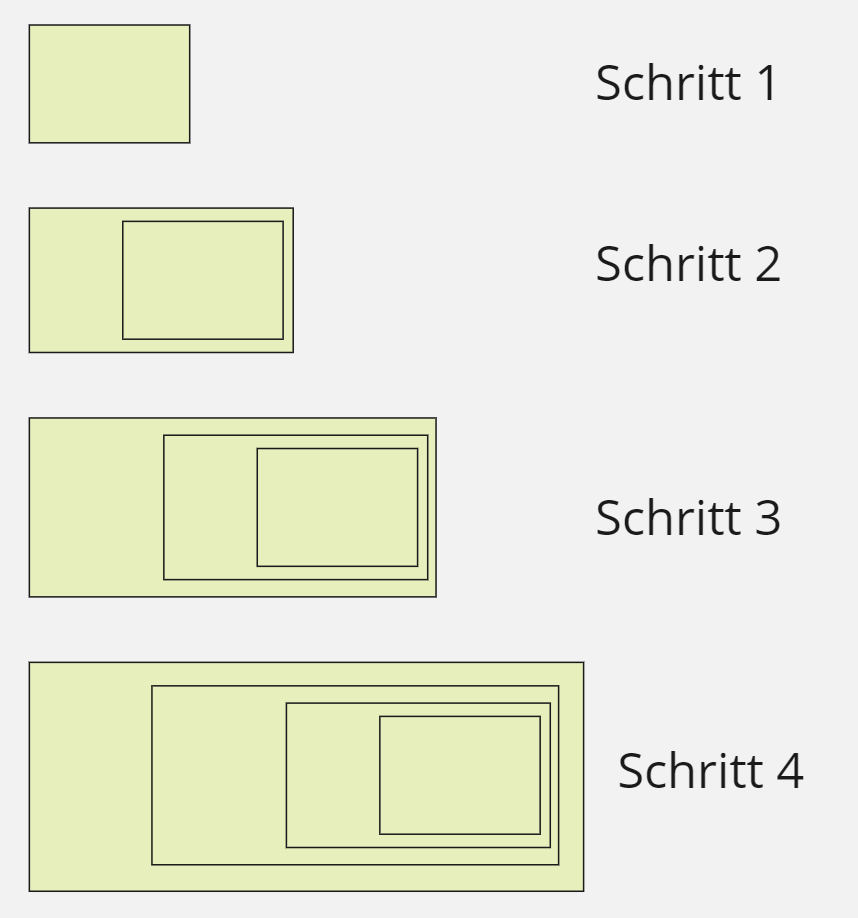

# Wiederholung Rekursion 

### Ablauf

- Beispiel in Kara (iterativ, dann rekursiv)
- Begriffe, Komponenten
- Einfaches Beispiel in BlueJ
- Gruppenaufgabe: Beispiele in BlueJ
- Speicherverwaltung
- Konzept: Divide And Conquer

### Lernziele

- Übersetzen von iterativen Lösungen in rekursive
- Sie wissen wann und wieso sie eine iterative, resp. eine rekursive Lösung bevorzugen.
- Sie kennen das Divide And Conquer Konzept
- (Sie können das DAC Konzept auf Problemstellungen anwenden)

### Definition

***Bei der rekursiven Programmierung ruft sich eine Prozedur, Funktion oder Methode in einem Computerprogramm selbst wieder auf.***

### Grundstruktur Rekursive Programme

~~~java
public class RecursiveSkeleton {

  public static void main() {
    	Process(<Parameters>);
  }

   public void Process(<Parameters>){
		if (<Condition>) 
			// Solve problem
		else {
			// Change Parameters...
			// Call again
			Process(<Parameters>);
		}
	}
}
~~~

Es benötigt immer eine Methode, die die rekursive Methode aufruft (der Start), wobei die rekursive Methode auch sich selbst aufruft. Im Beispiel oben führt die Methode "Process" den rekursiven Prozess/Algorithmus durch und ruft sich selbst auf und die Methode "main" startet den Ablauf.

Eine rekursive Methode benötigt jeweils eine **Rekursionsbasis**. Wenn diese erreicht wird, ist auch die Rekursion beendet.

~~~java
if (<Condition>) 
			// Solve problem
~~~

Ebenfalls benötigt wird die **Rekursionsvorschrift**, welche die Logik für den eigenen Aufruf enthält. Typischerweise wird vor oder nach dem Rekursionsaufruf zusätzlicher Code aufgerufen.

~~~java
else {
    // Change Parameters...
    // Call again
    Process(<Parameters>);
}
~~~

### Vor- und Nachteile

**Vorteile Rekursion**

- Lesbarkeit, Wartbarkeit.
- Oft ist der rekursive Code intuitiv verständlicher.

**Nachteile Rekursion:**

- Geschwindigkeit, Speicherverbrauch. Die Methode wird nicht verlassen und dadurch kann der Speicher nicht freigegeben werden. Im Gegenteil - eine weitere Methode wird aufgerufen, die zusätzlichen Speicher benötigt. 

In der folgenden Abbildung stellt ein **grüner** Block den **Speicherplatz** für eine Methode dar. In jedem rekursiven Aufruf, wird der Speicher aufgebläht, da die aufrufende Methode noch nicht beendet werden kann.

**Definition aus der Mathematik**: "Bei einer rekursiv definierten Folge kann ein bestimmtes Glied an der Folge aufgrund der Kenntnis vorangegangener Folgeglieder berechnet werden." (Hartmann)

Nehmen wir als Beispiel eine rekursiv definierte Folge - die Fibonacci-Folge. Der Wert für Fib(x) wird berechnet durch Fib(x-1) + Fib(x-2). Für ein konkretes Beispiel: Fib(30) = Fib(29) + Fib(28). Da Fib(29) und Fib(28) **nicht gespeicherte Werte** sind, werden diese in Echtzeit berechnet, wobei beide Werte ebenfalls auf den zwei vorangehenden Werten addiert wird, die berechnet werden müssen. Der Speicherbedarf wächst also ziemlich schnell.

**Fazit:**

***Vermeiden sie die Verwendung von Rekursion, wenn sie eine rekursiv definierte Folge programmieren.***

### Divide And Conquer (Teile und Herrsche)

Beschreibt ein Paradigma für den Entwurf von effizienten Algorithmen und kann allgemein wie im folgenden Bild dargestellt werden. Die Grundidee:

- Teile das Problem (oft als Array dargestellt). Die Teilung findet dabei nicht immer in der Mitte statt.
- Verarbeite, falls möglich, (Rekursionsbasis)
- Verarbeite Teil 1 und Teil 2 nach gleichem Schema (Rekursionsvorschrift)

Typische Beispiele für Divide And Conquer sind:

- Binäre Suche
- Quick Sort
- Merge Sort