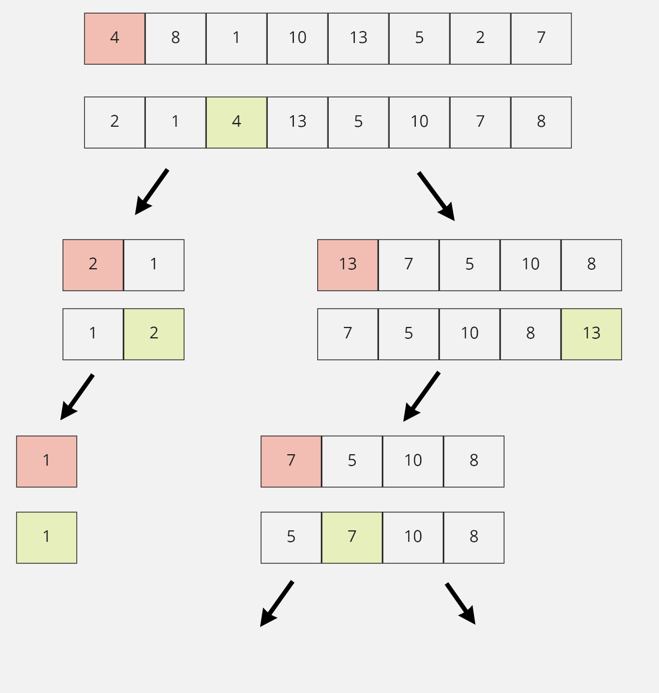

# Übung 4: Quick Sort

In dieser Übung verwenden sie Divide And Conquer, um ein Array zu **sortieren**. Machen sie die Übung **alleine**.

## Schritte

1. Verwenden sie den Code aus der letzten Übung als Basis.

2. Algorithmus:
   1. Nehme das erste Element im Array (als Referenz)

   2. Verschiebe das Element an die korrekte Position im Array. Die Werte links und rechts des Referenzwertes, müssen dabei nicht sortiert sein, aber auf der richtigen Seite.
   3. Mache das gleiche für den linken und rechten Teil des Referenzelements.

**Beispiel**: Das rote Element ist jeweils das Referenzelement. Nach der Sortierung ist es grün was bedeutet, dass es sich an der korrekte Position befindet.

